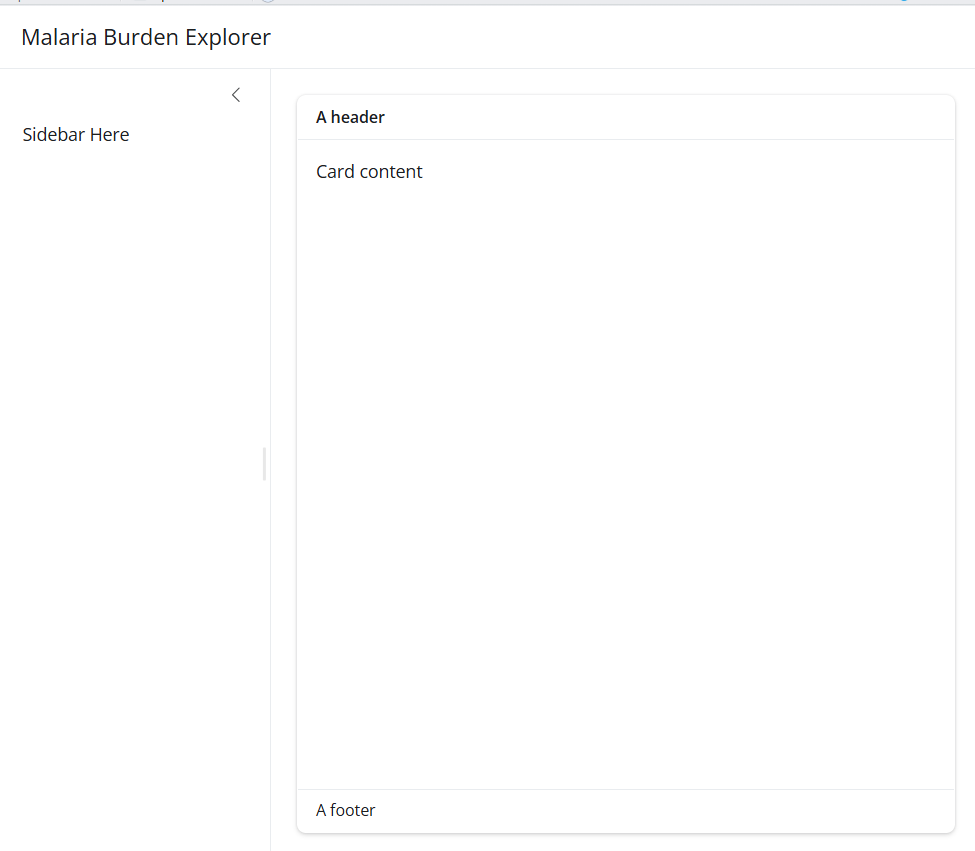
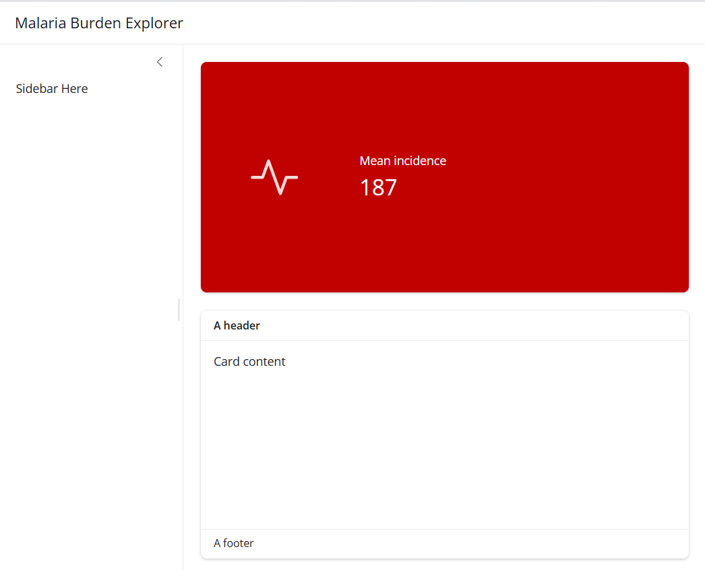
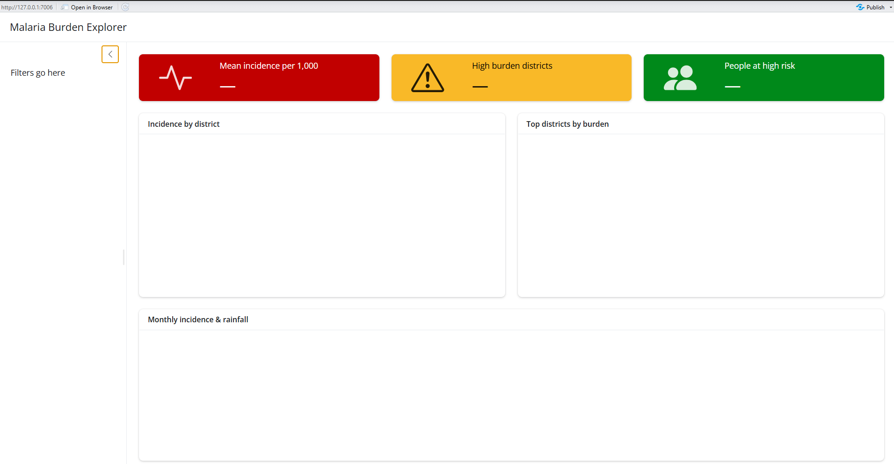

## Setup

### Create a project folder

Before writing any code, set up a clean project structure in RStudio:

`File → New Project → New Directory → New Project`

Name it `malaria-shiny-hackathon` and choose a sensible location on your
computer.

Your project should have the following structure:

```
malaria-shiny-hackathon/
├── app.R          ← your Shiny app (create this)
├── data/          ← provided datasets go here
└── www/           ← logo and images go here
```

### Required packages

Run this once in your console to install any missing packages:

```{r}
#| eval: false
pkgs <- c("shiny", "bslib", "tidyverse",
          "leaflet", "sf", "plotly",
          "DT", "bsicons", "scales", "htmltools")

install.packages(
  pkgs[!pkgs %in% rownames(installed.packages())]
)
```

Then load them at the top of every session:

```{r}
#| eval: false
library(shiny)
library(bslib)
library(tidyverse)
library(leaflet)
library(sf)
library(plotly)
library(DT)
library(bsicons)
library(scales)
```

### Training dataset

For this session you will use a pre-prepared dataset for **Burkina
Faso** covering 2020–2023. The dataset uses the real Burkina Faso
district shapefile from the Malaria Atlas Project, with simulated
malaria and intervention indicators that reflect realistic
epidemiological patterns for the country.

::: callout-important
## Download the training data

Download the three `.rds` files from the link below and save them into
your project's `data/` folder before starting:

📁 [**Download training data**](https://github.com/AMMnet/ammnet-hackathon/tree/main/09_shiny/data)

Your `data/` folder should contain:

- `malaria_data.rds` — monthly data for all districts
- `annual_summary.rds` — annual KPI summaries
- `bfa_districts.rds` — Burkina Faso district shapefile
:::

### Load the data

At the top of your `app.R`, after loading packages, add:

```{r}
#| eval: false
# load training datasets
malaria_data <- readRDS("data/malaria_data.rds")
annual_df    <- readRDS("data/annual_summary.rds")
district_shp <- readRDS("data/bfa_districts.rds")
```

### Quick data check

Run this in your console to confirm everything loaded correctly:

```{r}
#| eval: false
# monthly data
glimpse(malaria_data)

# how many districts and years?
cat("Districts:", n_distinct(malaria_data$district), "\n")
cat("Regions:",   n_distinct(malaria_data$region),   "\n")
cat("Years:",     unique(malaria_data$year),          "\n")
cat("Months:",    unique(malaria_data$month),         "\n")

# shapefile check
plot(sf::st_geometry(district_shp),
     main = "Burkina Faso — Districts")
```

You should see:

- **45 districts** across **13 regions**
- **4 years** × **12 months** = 2,160 rows per district
- A map of Burkina Faso districts


::: callout-note
## About this dataset

The shapefile is real — downloaded from the Malaria Atlas Project using
the `malariaAtlas` R package. The incidence, rainfall, and ITN coverage
values are simulated to reflect realistic epidemiological patterns for
Burkina Faso:

- Higher burden in the south and southwest (wetter, higher transmission)
- Lower burden in the north and Sahel (drier, lower transmission)
- Rainfall peaks July–August (Sahel wet season)
- Malaria incidence peaks September–October (6-week lag behind rainfall)
- ITN coverage improves gradually 2020–2023
:::

## What is Shiny?

Shiny is an R package developed by Posit (formerly RStudio) that lets
you build interactive web applications directly from R — no HTML, CSS,
or JavaScript knowledge required.

### Why Shiny for malaria data?

Malaria programmes generate large volumes of subnational data —
district-level incidence, rainfall, intervention coverage, health
facility access. Static plots and reports are useful but limited: they
show one view, fixed at the time of rendering.

Shiny changes that. Instead of sending a programme manager a PDF with 50
district plots, you give them a dashboard where they can:

- Select their district and year
- Explore trends interactively
- Zoom into the map
- Download the data they need

This is the kind of tool we are building today.

### What does a Shiny app look like?

At its simplest, a Shiny app is a single file called `app.R` that lives
in its own folder. It has three parts:

::: callout-note
## The three parts of every Shiny app

**1. UI (User Interface)** Defines what the user *sees* — the layout,
input controls (dropdowns, sliders), and placeholders for outputs (maps,
plots, tables).

**2. Server** Defines what the app *does* — filters data, builds plots,
computes summaries, and sends results back to the UI.

**3. shinyApp()** The function that ties UI and server together and
launches the app.
:::

Here is the simplest possible Shiny app:

```{r}
#| eval: false
library(shiny)
# type “runExample(”01_hello”)”
# 1. UI — what the user sees
ui <- fluidPage(
  titlePanel("My first Shiny app"),

  sidebarLayout(
    sidebarPanel(
      sliderInput(
        inputId = "bins",
        label   = "Number of bins:",
        min = 1, max = 50, value = 30
      )
    ),
    mainPanel(
      plotOutput("histogram")
    )
  )
)

# 2. Server — what the app does
server <- function(input, output, session) {

  output$histogram <- renderPlot({
    hist(faithful$waiting,
         breaks = input$bins,
         col    = "steelblue",
         main   = "Waiting times",
         xlab   = "Minutes")
  })

}

# 3. Launch the app
shinyApp(ui, server)
```

## Anatomy of a Shiny App

Now that you have seen a Shiny app run, let's understand each part in
detail before we start building our malaria dashboard.

### Modern Shiny with bslib

The app above uses `fluidPage()` — the classic Shiny layout. In this
session we use `bslib` instead, which gives us a more modern,
responsive, and visually polished layout with very little extra code.

::: callout-note
## What is bslib?

[bslib](https://rstudio.github.io/bslib/index.html) is Posit's modern UI
toolkit for Shiny. It is built on Bootstrap 5 and replaces the older
`shinydashboard` package. Key advantages:

- Cleaner, more professional look out of the box
- Easy theming with `bs_theme()`
- Modern components: `card()`, `value_box()`, `layout_columns()`
- Actively maintained and updated
:::

### The UI in depth

The UI is built by nesting R functions inside each other. Each function
adds an element to the page — a title, a sidebar, a dropdown, a plot
placeholder.

In `bslib`, the top-level layout function is `page_sidebar()`:

```{r}
#| eval: false
ui <- page_sidebar(
  title = "My Dashboard",    # top navigation bar

  sidebar = sidebar(         # left panel
    "Sidebar content here"
  ),

  "Main content here"        # right panel
)
```

This gives you the classic two-pane layout — sidebar on the left, main
content on the right.

#### Alternative layouts

`page_sidebar()` is not the only option. bslib provides several layout
functions depending on what you need:

**page_fluid()** — a floating sidebar that grows with content rather
than filling the page:

```{r}
#| eval: false
ui <- page_fluid(
  layout_sidebar(
    sidebar = sidebar("Sidebar"),
    "Main contents"
  )
)
```

**page_navbar()** — a multi-page layout with a navigation bar at the
top, useful when your dashboard has several distinct sections:

```{r}
#| eval: false
ui <- page_navbar(
  title = "Malaria Dashboard",

  nav_panel("Overview",  "Overview content"),
  nav_panel("Districts", "District content"),
  nav_panel("About",     "About this app")
)
```

::: callout-note
## Which layout to use?

| Layout           | Best for                                |
|------------------|-----------------------------------------|
| `page_sidebar()` | Single-page dashboards with filters     |
| `page_fluid()`   | Flexible layouts that grow with content |
| `page_navbar()`  | Multi-section dashboards with tabs      |

For our malaria dashboard we use `page_sidebar()`.
:::

#### Cards

Cards are the core building block of a modern dashboard. They group
related content in a clean bordered container.

```{r}
#| eval: false
card(
  "Card content"
)
```

Add structure to a card using `card_header()`, `card_body()` and
`card_footer()`:

::::: columns
::: {.column width="55%"}
```{r}
#| eval: false
card(
  card_header("A header"),
  card_body("Card content"),
  card_footer("A footer")
)
```
:::

::: {.column width="45%"}
{width="100%"}
:::
:::::

Add `full_screen = TRUE` to let users expand the card to fill the
browser window — essential for maps and charts:

```{r}
#| eval: false
card(
  full_screen = TRUE,
  card_header("Incidence map"),
  card_body(leafletOutput("map"))
)
```

#### Value boxes

Value boxes highlight a single important number with an icon and a theme
colour:

::::: columns
::: {.column width="55%"}
```{r}
#| eval: false
value_box(
  title    = "Mean incidence",
  value    = 187,
  showcase = bs_icon("activity"),
  theme    = "danger"
)
```
:::

::: {.column width="45%"}
{width="100%"}
:::
:::::

Available themes: `"danger"`, `"warning"`, `"success"`, `"info"`,
`"primary"`, `"secondary"`, or Bootstrap colours like `"teal"`,
`"purple"`.

::: callout-tip
## Browsing icons

Use `bsicons::bs_icon()` for icons. Browse the full library at
[icons.getbootstrap.com](https://icons.getbootstrap.com/) — search for
any concept and copy the icon name.
:::

#### layout_columns() — side by side

By default elements stack vertically. Wrap them in `layout_columns()` to
place them side by side:

::::: columns
::: {.column width="55%"}
```{r}
#| eval: false
# equal split
layout_columns(
  card("Left card"),
  card("Right card")
)

# unequal split — 12 columns total
layout_columns(
  col_widths = c(7, 5),
  card("Wider card"),
  card("Narrower card")
)
```
:::

::: {.column width="45%"}
{width="100%"}
:::
:::::

::: callout-note
## The 12-column grid

Shiny divides the page into 12 columns. `col_widths = c(7, 5)` means the
first element gets 7/12 of the width and the second gets 5/12. They must
add up to 12.

Common splits:

| Split                  | col_widths   |
|------------------------|--------------|
| Equal halves           | `c(6, 6)`    |
| Two thirds / one third | `c(8, 4)`    |
| Three equal columns    | `c(4, 4, 4)` |
:::

## Inputs

Inputs are how users talk to your app. When a user changes a dropdown or
moves a slider, Shiny passes that value to the server as
`input$inputId`.

{width="100%"}

::: callout-note
## Three things every input needs

1.  **`inputId`** — unique name, accessed in server as `input$inputId`
2.  **`label`** — text shown above the control
3.  **A value** — `choices`, `value`, or `min/max`
:::

### Input functions and their widgets

Shiny provides a family of input functions. Each function creates a
different type of control widget in the UI:


### Some Input types

#### selectInput() — dropdown

```{r}
#| eval: false
selectInput(
  inputId  = "year",
  label    = "Year",
  choices  = c(2020, 2021, 2022, 2023),
  selected = 2023
)
```

Add `multiple = TRUE` to allow selecting more than one option.

#### radioButtons() — best for 2–4 choices

```{r}
#| eval: false
radioButtons(
  inputId  = "admin_level",
  label    = "Display level",
  choices  = c("Region", "District"),
  selected = "District",
  inline   = TRUE
)
```

#### sliderInput() — numeric range

```{r}
#| eval: false
sliderInput(
  inputId = "threshold",
  label   = "High burden threshold",
  min     = 0,
  max     = 500,
  value   = 200,
  step    = 10
)
```

Pass two values to `value` for a range slider: `value = c(100, 400)`.

### conditionalPanel() — dynamic inputs

Show an input only when another input has a specific value:

```{r}
#| eval: false
sidebar = sidebar(

  radioButtons(
    inputId  = "admin_level",
    label    = "Display level",
    choices  = c("Region", "District"),
    selected = "District",
    inline   = TRUE
  ),

  # only shows when District is selected
  conditionalPanel(
    condition = "input.admin_level == 'District'",
    selectInput(
      inputId  = "district",
      label    = "District",
      choices  = sort(unique(malaria_data$district)),
      selected = "District 1"
    )
  )
)
```

::: callout-note
## JavaScript dot notation

Inside `conditionalPanel()` use `input.admin_level` not
`input$admin_level` — the condition runs in the browser using
JavaScript, not R.
:::

### Exercise 1 {.unnumbered}

**1a.** Add a `checkboxInput()` with `inputId = "show_rainfall"`, label
*"Show rainfall line"*, ticked by default.

**1b.** Add a `conditionalPanel()` that shows a region `selectInput()`
only when `input.admin_level == 'Region'`.

::: {.callout-caution collapse="true"}
## Show solution

**2a.**

```{r}
#| eval: false
checkboxInput(
  inputId = "show_rainfall",
  label   = "Show rainfall line",
  value   = TRUE
)
```

**2b.**

```{r}
#| eval: false
conditionalPanel(
  condition = "input.admin_level == 'Region'",
  selectInput(
    inputId  = "region",
    label    = "Region",
    choices  = sort(unique(malaria_data$region)),
    selected = "Northern"
  )
)
```
:::

### Pause and check ✅

- [ ] You can add `selectInput()`, `sliderInput()` and `checkboxInput()`
  to the sidebar
- [ ] You know `inputId` connects UI to server
- [ ] You understand `input.x` vs `input$x`
- [ ] Your app runs without errors

## Outputs and Reactivity

This is the most important section in the document. Everything in the
dashboard build depends on understanding how outputs and reactivity
connect.

### How outputs work in Shiny

Creating an output in Shiny is always a two-step process:

**Step 1** — Add a placeholder to the UI telling Shiny *where* to
display the output.

**Step 2** — Tell Shiny *how* to build the output in the server
function.

### Output types

Outputs in the UI create place holders that are later filled by the
server function. Instead of an `inputId`, outputs take an `outputId`. If
the UI has an output with ID plot, it can be accessed in the server
function with `output$plot`.

Each output function in the UI has a corresponding render function in
the server function.

There are three main types of output:

- plots
- tables
- text

Shiny provides a family of functions that turn R objects into
browser-ready outputs. Every output type has:

- One **display function** → goes in the UI
- One **render function** → goes in the server
- A **shared `outputId`** → connects the two

| Output type | Render function (server) | Display function (UI) | When to use |
|------------------|------------------|------------------|------------------|
| Text | `renderText()` | `textOutput()` | Simple text strings |
| Static table | `renderTable()` | `tableOutput()` | Small fixed tables |
| Interactive table | `renderDT()` | `DTOutput()` | Sortable, searchable tables |
| Static plot | `renderPlot()` | `plotOutput()` | ggplot, base R plots |
| Interactive plot | `renderPlotly()` | `plotlyOutput()` | Hover, zoom, pan |
| Leaflet map | `renderLeaflet()` | `leafletOutput()` | Interactive maps |
| Image | `renderImage()` | `imageOutput()` | PNG, JPG files |
| Dynamic UI | `renderUI()` | `uiOutput()` | Generate UI on the fly |
| Value box | *(no render function)* | `value_box()` | Single KPI highlights |

### Building your first output — UI and server crosstalk

Let us work through a concrete example. We will add a text output to one
of our dashboard cards that shows a data summary.

Our goal: display a sentence showing which year and how many districts
are in the current dataset.

#### Step 1 — Add a placeholder in the UI

Inside one of your `card()` containers, replace the placeholder text
with a `textOutput()`:

```{r}
#| eval: false
card(
  card_header("Data summary"),
  card_body(
    textOutput("date_summary")   # ← placeholder
  )
)
```

The string `"date_summary"` is the `outputId`. The user never sees this
— it is the bridge between UI and server.

#### Step 2 — Build the output in the server

Inside your server function, add:

```{r}
#| eval: false
server <- function(input, output, session) {

  output$date_summary <- renderText({
    "Data covers Burkina Faso districts,
     2020 to 2023"
  })

}
```

### Making it reactive

Right now the text is fixed — it never changes. Let us connect it to
`input$year` so it updates when the user changes the year dropdown.

Update your server:

```{r}
#| eval: false
output$date_summary <- renderText({
  paste0(
    "Showing data for: ", input$year,
    " | Burkina Faso"
  )
})
```

Run your app. Change the year dropdown — the sentence updates
automatically.

### render functions — what they actually do

A render function has two jobs:

1.  **Generate** something to display — a plot, map, table, or piece of
    text.
2.  **Automatically regenerate** it whenever one of its inputs changes.

That second job is what makes Shiny feel alive. The technical term is a
*reactive context* — but the practical meaning is: Shiny watches what
you read inside a render function and re-runs the function whenever
those values change.

### reactive() — filter once, use everywhere

#### What are reactive expressions?

Reactive expressions are R expressions that take reactive inputs and
return a value.

They serve as a bridge between user inputs (like sliders, buttons, or
text inputs) and the outputs (such as plots, tables, or text) in your
Shiny app.

When an input changes, the related reactive expressions automatically
update their values.

#### Reactive expressions

We will consider two reactive expressions:

`reactive()`:

- It allows you to defi ne a computation that depends on reactive inputs
  (such as user interactions) and returns a value.
- When any of its dependencies change, the reactive expression is
  automatically re-evaluated.

`eventReactive()`:

- The eventReactive() function is similar to reactive(), but with a
  specific trigger event.
- It allows you to create a reactive expression that updates only when a specific event occurs (e.g., button click).

### observeEvent() — reacting without an output

Sometimes you want to react to an input but not produce a visible output
— for example, updating a dropdown list when another dropdown changes.

```{r}
#| eval: false
# when region changes, update district choices
observeEvent(input$region, {

  choices <- if (input$region == "All regions") {
    sort(unique(malaria_data$district))
  } else {
    malaria_data |>
      filter(region == input$region) |>
      pull(district) |> unique() |> sort()
  }

  updateSelectInput(
    session  = session,
    inputId  = "district",
    choices  = choices,
    selected = choices[1]
  )

})
```

::: callout-note
## observe() vs observeEvent()

- `observe()` — re-runs when ANY reactive value inside it changes
- `observeEvent(input$x, {...})` — re-runs only when `input$x`
  specifically changes

Use `observeEvent()` — it is explicit and predictable.
:::

### Exercise 3 {.unnumbered}

**3a.** Add a `renderText()` output that shows the number of districts
currently in the filtered data. Display it with `textOutput()` below the
slider in the sidebar.

**3b.** Add a `renderDT()` output showing a summary table of mean
incidence and mean ITN coverage per district. Place it in a new card
below the trend placeholder.

**3c.** Add an `observeEvent()` that updates the district dropdown when
the region changes — so only districts in the selected region appear.

::: {.callout-caution collapse="true"}
## Show solution

**3a.** UI — add below `sliderInput()`:

```{r}
#| eval: false
hr(),
textOutput("sidebar_summary")
```

Server:

```{r}
#| eval: false
output$sidebar_summary <- renderText({
  paste0(
    n_distinct(filtered_data()$district),
    " districts selected"
  )
})
```

**3b.** UI — add new card:

```{r}
#| eval: false
card(
  card_header("District summary"),
  card_body(DTOutput("data_table"))
)
```

Server:

```{r}
#| eval: false
output$data_table <- renderDT({
  filtered_data() |>
    group_by(district, region) |>
    summarise(
      mean_inc = round(
        mean(incidence,    na.rm = TRUE), 1),
      mean_itn = round(
        mean(itn_coverage, na.rm = TRUE), 1),
      .groups  = "drop"
    ) |>
    arrange(desc(mean_inc)) |>
    datatable(
      rownames = FALSE,
      options  = list(pageLength = 10)
    )
})
```

**3c.**

```{r}
#| eval: false
observeEvent(input$region, {
  choices <- if (input$region == "All regions") {
    sort(unique(malaria_data$district))
  } else {
    malaria_data |>
      filter(region == input$region) |>
      pull(district) |> unique() |> sort()
  }
  updateSelectInput(
    session  = session,
    inputId  = "district",
    choices  = choices,
    selected = choices[1]
  )
})
```
:::

### Pause and check ✅

- [ ] You understand the two-step process: UI placeholder + server
  render function
- [ ] Every output type has a matching pair
- [ ] The shared `outputId` connects UI to server
- [ ] `reactive()` filters once — shared by all outputs
- [ ] Always call reactive expressions with `()`
- [ ] `observeEvent()` handles side effects like updating dropdowns
- [ ] Shiny tracks dependencies automatically — you never write "watch
  for changes"

## Stage 1: Layout skeleton

Now we start writing actual app code. In this section we build the
skeleton of our malaria dashboard — the layout structure with no data or
reactivity yet. By the end you will have a running app that looks like a
real dashboard.

### Create your app.R file

In your project folder, create a new R script and save it as `app.R`.
This is where all your app code lives.

Start with this skeleton — copy it exactly:

```{r}
#| eval: false
# ── packages ────────────────────────────────────────
library(shiny)      # core package — builds the interactive web app
library(bslib)      # modern UI layout and theming (Bootstrap 5)
library(tidyverse)  # data wrangling and ggplot2 for plotting
library(leaflet)    # interactive maps
library(sf)         # reads and handles shapefiles (spatial data)
library(plotly)     # converts ggplot charts to interactive plots
library(DT)         # interactive sortable and searchable tables
library(bsicons)    # Bootstrap icons for value boxes and UI elements
library(scales)     # formats numbers (commas, percentages, currency)
library(htmltools)  # renders HTML in leaflet hover labels

# ── load data ───────────────────────────────────────
malaria_data <- readRDS("data/malaria_data.rds")
annual_df    <- readRDS("data/annual_summary.rds")
district_shp <- readRDS("data/bfa_districts.rds")

# ── ui ──────────────────────────────────────────────
ui <- page_sidebar(
  title = "Malaria Burden Explorer",

  sidebar = sidebar(
    "Filters go here"
  ),

  "Main content goes here"
)

# ── server ──────────────────────────────────────────
server <- function(input, output, session) {

}

# ── launch ──────────────────────────────────────────
shinyApp(ui, server)
```

Click **Run App** in RStudio. You should see a plain page with a sidebar
on the left and a main panel on the right.

### page_sidebar() layout

`page_sidebar()` gives us the two-pane layout we need — a sidebar for
filters and a main area for visualisations.

| Argument  | What it does                         |
|-----------|--------------------------------------|
| `title`   | Text shown in the top navigation bar |
| `sidebar` | Content for the left sidebar panel   |
| `...`     | Content for the main right panel     |

### Adding cards

Cards are the building blocks of a modern dashboard. They are bordered
containers that group related content.

Update your UI to replace `"Main content goes here"` with this:

```{r}
#| eval: false
ui <- page_sidebar(
  title = "Malaria Burden Explorer",

  sidebar = sidebar(
    "Filters go here"
  ),

  # ── row 1: value boxes ──────────────────────────
  layout_columns(
    value_box(
      title    = "Mean incidence per 1,000",
      value    = "—",
      showcase = bs_icon("activity"),
      theme    = "danger"
    ),
    value_box(
      title    = "High burden districts",
      value    = "—",
      showcase = bs_icon("exclamation-triangle"),
      theme    = "warning"
    ),
    value_box(
      title    = "People at high risk",
      value    = "—",
      showcase = bs_icon("people-fill"),
      theme    = "success"
    )
  ),

  # ── row 2: map + bar chart ───────────────────────
  layout_columns(
    card(
      full_screen = TRUE,
      card_header("Incidence by district"),
      card_body(
        leafletOutput("map", height = 380)
      )
    ),
    card(
      full_screen = TRUE,
      card_header("Top districts by burden"),
      card_body(
        plotlyOutput("bar_chart", height = 380)
      )
    )
  ),

  # ── row 3: trend panel ───────────────────────────
  card(
    full_screen = TRUE,
    card_header(
      "Monthly incidence & rainfall"
    ),
    card_body(
      plotlyOutput("trend_chart", height = 300)
    )
  )
)
```

Refresh your app. You should now see:

- Three value box placeholders across the top
- Two side-by-side card placeholders in the middle
- One full-width card at the bottom

::: {.column width="100%"}

:::

::: callout-note
## What these layout functions do

- `layout_columns()` — places elements side by side, dividing available
  width equally. Add `col_widths = c(6, 6)` to control the split.
- `card()` — a bordered container for one piece of content
- `card_header()` — a labelled header bar for the card
- `card_body()` — the main content area of the card
- `value_box()` — a highlighted KPI summary box
- `full_screen = TRUE` — adds a button to expand the card to full screen
:::

### Adding sidebar inputs

Now replace `"Filters go here"` in the sidebar with real input controls:

```{r}
#| eval: false
sidebar = sidebar(

  # app description
  p("Explore district-level malaria burden
     across Burkina Faso. Select a year and
     district to update all panels."),

  hr(), # horizontal divider

  # year selector
  selectInput(
    inputId  = "year",
    label    = "Year",
    choices  = sort(unique(malaria_data$year)),
    selected = max(malaria_data$year)
  ),

  # region selector
  selectInput(
    inputId  = "region",
    label    = "Region",
    choices  = c("All regions",
                 sort(unique(malaria_data$region))),
    selected = "All regions"
  ),

  # district selector for trend panel
  selectInput(
    inputId  = "district",
    label    = "District (trend chart)",
    choices  = sort(unique(malaria_data$district)),
    selected = sort(unique(malaria_data$district))[1]
  ),

  hr(),

  # burden threshold slider
  sliderInput(
    inputId = "threshold",
    label   = "High burden threshold
               (incidence per 1,000)",
    min   = 0,
    max   = 500,
    value = 200,
    step  = 10
  )

)
```

Refresh your app. The sidebar should now show a description, two
dropdowns, and a slider.

::: {.column width="100%"}

:::

::: callout-warning
## Nothing reacts yet

The inputs are visible but nothing happens when you change them — the
server is still empty. That changes in the next section when we wire
everything together with reactivity.
:::

### Exercise 1 {.unnumbered}

Before moving on, try these on your own:

**1a.** Change the `theme` of one of the value boxes to `"primary"`.
What colour does it become?

**1b.** Add `col_widths = c(7, 5)` to the `layout_columns()` wrapping
the map and bar chart. What changes?

**1c.** Add a `card_footer()` below the `card_body()` in the trend chart
card with the text *"Source: Simulated data for training purposes"*.

::: {.callout-caution collapse="true"}
## Show solution

**1a.** Replace `theme = "danger"` with `theme = "primary"` on any value
box:

```{r}
#| eval: false
value_box(
  title    = "Mean incidence per 1,000",
  value    = "—",
  showcase = bs_icon("activity"),
  theme    = "primary"     # changed from "danger"
)
```

**1b.** Add `col_widths` to `layout_columns()`:

```{r}
#| eval: false
layout_columns(
  col_widths = c(7, 5),   # map gets 7/12, bar gets 5/12
  card(...),              # map card
  card(...)               # bar chart card
)
```

**1c.** Add `card_footer()` after `card_body()`:

```{r}
#| eval: false
card(
  full_screen = TRUE,
  card_header("Monthly incidence & rainfall"),
  card_body(
    plotlyOutput("trend_chart", height = 300)
  ),
  card_footer(            # add this
    "Source: Simulated data for training purposes"
  )
)
```
:::

### Pause and check ✅

Before moving to next section, confirm:

- [ ] Your app runs without errors
- [ ] You see three value boxes across the top
- [ ] You see two cards side by side in the middle
- [ ] You see one full-width card at the bottom
- [ ] The sidebar has a description, two dropdowns, and a slider
- [ ] Changing the inputs does nothing yet — that is expected

------------------------------------------------------------------------

## Stage 2: Data, Inputs and KPIs

### Step 1 — Connect value boxes to data

Replace the three hardcoded `value = "—"` with `textOutput()`
placeholders:

```{r}
#| eval: false
value_box(
  title    = "Mean incidence per 1,000",
  value    = textOutput("kpi_mean"),      # ← changed
  showcase = bs_icon("activity"),
  theme    = "danger"
),
value_box(
  title    = "High burden districts",
  value    = textOutput("kpi_count"),     # ← changed
  showcase = bs_icon("exclamation-triangle"),
  theme    = "warning"
),
value_box(
  title    = "Mean ITN coverage",
  value    = textOutput("kpi_itn"),       # ← changed
  showcase = bs_icon("shield-check"),
  theme    = "success"
)
```

### Step 2 — Add server logic

Replace your empty server with this:

```{r}
#| eval: false
server <- function(input, output, session) {

  # ── reactive dataset ─────────────────────────────
  # filters once — shared by all outputs
  filtered_data <- reactive({
    malaria_data |>
      filter(
        year == input$year,
        input$region == "All regions" |
          region == input$region
      )
  })

  # ── update district when region changes ──────────
  observeEvent(input$region, {
    choices <- if (input$region == "All regions") {
      sort(unique(malaria_data$district))
    } else {
      malaria_data |>
        filter(region == input$region) |>
        pull(district) |>
        unique() |>
        sort()
    }
    updateSelectInput(
      session  = session,
      inputId  = "district",
      choices  = choices,
      selected = choices[1]
    )
  })

  # ── KPI outputs ──────────────────────────────────
  output$kpi_mean <- renderText({
    round(
      mean(filtered_data()$incidence,
           na.rm = TRUE), 1)
  })

  output$kpi_count <- renderText({
    df <- filtered_data()
    n_distinct(
      df$district[df$incidence >= input$threshold]
    )
  })

  output$kpi_itn <- renderText({
    paste0(
      round(
        mean(filtered_data()$itn_coverage,
             na.rm = TRUE), 1), "%"
    )
  })

}
```

### Step 3 — Run your app

Click **Run App**. You should now see:

- Three value boxes showing real numbers
- Changing year updates all three instantly
- Moving the threshold slider updates the high burden count
- Changing region filters all KPIs


### Exercise 2 {.unnumbered}

**2a.** Add a fourth value box showing the name of the highest burden
district. Use `bs_icon("geo-alt")` and `theme = "info"`.

**2b.** Add a `textOutput("sidebar_summary")` below the slider in the
sidebar. In the server add a `renderText()` that shows how many
districts are currently selected.

**2c.** Move the threshold slider and observe `kpi_count` changing. What
happens at threshold = 0? What about 500?

::: {.callout-caution collapse="true"}
## Show solution

**2a.** UI:

```{r}
#| eval: false
value_box(
  title    = "Highest burden district",
  value    = textOutput("kpi_top"),
  showcase = bs_icon("geo-alt"),
  theme    = "info"
)
```

Server:

```{r}
#| eval: false
output$kpi_top <- renderText({
  filtered_data() |>
    group_by(district) |>
    summarise(
      mean_inc = mean(incidence, na.rm = TRUE)
    ) |>
    slice_max(mean_inc, n = 1) |>
    pull(district)
})
```

**2b.** UI — add below `sliderInput()`:

```{r}
#| eval: false
hr(),
textOutput("sidebar_summary")
```

Server:

```{r}
#| eval: false
output$sidebar_summary <- renderText({
  paste0(
    n_distinct(filtered_data()$district),
    " districts selected"
  )
})
```

**2c.** At threshold = 0 all districts are high burden. At 500 none are
— `kpi_count` shows 0.
:::

### Pause and check ✅

- [ ] Data loads without errors
- [ ] Sidebar shows four inputs
- [ ] Value boxes show real numbers
- [ ] Changing year updates all KPIs
- [ ] Moving slider updates high burden count
- [ ] Changing region filters correctly
- [ ] District dropdown updates when region changes
- [ ] No errors in the console

------------------------------------------------------------------------

## Stage 3: Map and Bar Chart

**Goal:** Replace both card placeholders with real interactive
visualisations. By the end you have a choropleth map and a ranked bar
chart that update together when inputs change.


::: callout-note
## What you learn in this stage

- `leafletOutput()` + `renderLeaflet()` for maps
- Joining data to a shapefile
- `colorBin()` for map colour palette
- `plotlyOutput()` + `renderPlotly()` for charts
- `ggplot → ggplotly()` conversion
- One `reactive()` feeding multiple outputs
:::

### Step 1 — Add two helper functions

Add these below your data loading, before the UI:

```{r}
#| eval: false
# ── helpers ──────────────────────────────────────────

# colour palette for the map
make_pal <- function(values) {
  colorBin(
    palette  = "YlOrRd",
    domain   = values,
    bins     = c(0, 50, 100, 200,
                 300, 400, 500, Inf),
    na.color = "#f0f0f0"
  )
}

# top districts summary
top_districts <- function(df, n = 10) {
  df |>
    group_by(district, region) |>
    summarise(
      mean_inc = round(
        mean(incidence,    na.rm = TRUE), 1),
      mean_itn = round(
        mean(itn_coverage, na.rm = TRUE), 1),
      .groups  = "drop"
    ) |>
    slice_max(mean_inc, n = n) |>
    arrange(mean_inc)
}
```

::: callout-note
## Why helper functions?

`make_pal()` is called inside `renderLeaflet()`. `top_districts()` is
called inside both `renderPlotly()` and potentially `renderDT()`.
Writing them once outside the server keeps the server clean and avoids
repetition.
:::

### Step 2 — Update the UI - Add class in header

Replace both placeholder cards with output containers:

```{r}
#| eval: false
layout_columns(

  # map card
  card(
    full_screen = TRUE,
    card_header(
      "Incidence by district",
      class = "bg-danger text-white"
    ),
    card_body(
      leafletOutput("map", height = "420px")
    )
  ),

  # bar chart card
  card(
    full_screen = TRUE,
    card_header(
      "Top 10 districts by burden",
      class = "bg-warning text-dark"
    ),
    card_body(
      plotlyOutput("bar_chart", height = "420px")
    )
  )

)
```

### Step 3 — Add renderLeaflet() to server

Add below your KPI outputs:

```{r}
#| eval: false
# ── map ──────────────────────────────────────────────
output$map <- renderLeaflet({

  # summarise to one row per district
  df <- filtered_data() |>
    group_by(district) |>
    summarise(
      mean_inc = round(
        mean(incidence, na.rm = TRUE), 1),
      mean_itn = round(
        mean(itn_coverage, na.rm = TRUE), 1),
      .groups  = "drop"
    )

  # join to shapefile
  map_data <- district_shp |>
    left_join(df, by = "district")

  # colour palette
  pal <- make_pal(map_data$mean_inc)

  # build map
  leaflet(map_data) |>
    addProviderTiles(
      providers$CartoDB.Positron
    ) |>
    addPolygons(
      fillColor   = ~pal(mean_inc),
      fillOpacity = 0.8,
      color       = "#444444",
      weight      = 0.8,
      label = ~paste0(
        "<b>", district,    "</b><br>",
        "Incidence: ", mean_inc,
        " per 1,000<br>",
        "ITN: ",       mean_itn, "%"
      ) |> lapply(htmltools::HTML),
      highlightOptions = highlightOptions(
        weight       = 2,
        color        = "#222222",
        fillOpacity  = 0.9,
        bringToFront = TRUE
      )
    ) |>
    addLegend(
      pal      = pal,
      values   = ~mean_inc,
      position = "bottomright",
      title    = "Incidence<br>per 1,000"
    )
})
```

### Step 4 — Add renderPlotly() to server

Add below `output$map`:

```{r}
#| eval: false
# ── bar chart ─────────────────────────────────────────
output$bar_chart <- renderPlotly({

  df <- top_districts(filtered_data())

  p <- ggplot(df,
    aes(
      x    = mean_inc,
      y    = reorder(district, mean_inc),
      fill = mean_inc,
      text = paste0(
        "<b>", district,      "</b><br>",
        "Region: ",    region,   "<br>",
        "Incidence: ", mean_inc,
        " per 1,000<br>",
        "ITN: ",       mean_itn, "%"
      )
    )
  ) +
  geom_col() +
  geom_vline(
    xintercept = input$threshold,
    linetype   = "dashed",
    colour     = "#333333",
    linewidth  = 0.6
  ) +
  scale_fill_gradient(
    low  = "#fdae61",
    high = "#a50026"
  ) +
  scale_x_continuous(
    labels = comma,
    expand = expansion(mult = c(0, 0.1))
  ) +
  labs(
    x = "Mean incidence per 1,000",
    y = NULL
  ) +
  theme_minimal(12) +
  theme(legend.position = "none")

  ggplotly(p, tooltip = "text")
})
```


### Exercise 3 {.unnumbered}

**3a.** Change the map background tiles from `CartoDB.Positron` to
`Esri.WorldGrayCanvas`. Run `names(providers)` to explore options.

**3b.** Add ITN coverage as a second colour option. Add a
`radioButtons()` to the sidebar:

```{r}
#| eval: false
radioButtons(
  inputId  = "map_indicator",
  label    = "Map indicator",
  choices  = c("Incidence"     = "mean_inc",
               "ITN coverage"  = "mean_itn"),
  selected = "mean_inc",
  inline   = TRUE
)
```

Then update `renderLeaflet()` to use `input$map_indicator` to select
which column to colour by.

**3c.** Add `col_widths = c(6, 6)` to the `layout_columns()` — confirm
both cards are equal width.

::: {.callout-caution collapse="true"}
## Show solution

**3a.**

```{r}
#| eval: false
addProviderTiles(providers$Esri.WorldGrayCanvas)
```

**3b.** Update `renderLeaflet()`:

```{r}
#| eval: false
# use selected indicator
indicator <- input$map_indicator

pal <- make_pal(map_data[[indicator]])

addPolygons(
  fillColor = ~pal(map_data[[indicator]]),
  ...
)
```

**3c.**

```{r}
#| eval: false
layout_columns(
  col_widths = c(6, 6),
  card(...),   # map
  card(...)    # bar chart
)
```
:::

### Pause and check ✅

- [ ] Choropleth map appears on load
- [ ] Districts coloured yellow to red
- [ ] Hovering shows district details
- [ ] Bar chart shows top 10 districts
- [ ] Dashed threshold line visible on bar chart
- [ ] Both update when year changes
- [ ] Both update when region changes
- [ ] No errors in the console

------------------------------------------------------------------------

## Stage 4: Trend Chart and Polish

**Goal:** Complete the dashboard with the rainfall-incidence trend chart
and make it look professional with theming and polish.

::: callout-note
## What you learn in this stage

- Dual-axis `plotly` chart
- `bs_theme()` for professional theming
- `tags$img()` for logo
- `input_dark_mode()` for dark/light toggle
- `downloadHandler()` for CSV export
:::

### Step 1 — Update the trend card in UI

Replace the trend placeholder:

```{r}
#| eval: false
card(
  full_screen = TRUE,
  card_header(
    "Monthly incidence & rainfall",
    class = "bg-info text-dark"
  ),
  card_body(
    plotlyOutput("trend_chart", height = "300px")
  ),
  card_footer(
    "Rainfall peaks July–August ·
     Incidence peaks September–October"
  )
)
```

### Step 2 — Add renderPlotly() for trend

Add below `output$bar_chart` in server:

```{r}
#| eval: false
# ── trend chart ───────────────────────────────────────
output$trend_chart <- renderPlotly({

  # all years for selected district
  df <- malaria_data |>
    filter(district == input$district)

  p <- ggplot(df, aes(x = month)) +

    # rainfall bars — background
    geom_col(
      aes(
        y    = rainfall_mm / 3,
        text = paste0(
          "Month: ",    month.abb[month], "<br>",
          "Rainfall: ", rainfall_mm, " mm"
        )
      ),
      fill  = "#378ADD",
      alpha = 0.4
    ) +

    # incidence lines — one per year
    geom_line(
      aes(
        y      = monthly_incidence,
        colour = factor(year),
        group  = year,
        text   = paste0(
          "Month: ",     month.abb[month], "<br>",
          "Year: ",      year,             "<br>",
          "Incidence: ", monthly_incidence,
          " per 1,000"
        )
      ),
      linewidth = 1
    ) +
    geom_point(
      aes(
        y      = monthly_incidence,
        colour = factor(year),
        group  = year
      ),
      size = 2
    ) +

    scale_x_continuous(
      breaks = 1:12,
      labels = month.abb
    ) +
    scale_colour_brewer(
      palette = "Set2",
      name    = "Year"
    ) +
    scale_y_continuous(
      name     = "Monthly incidence per 1,000",
      sec.axis = sec_axis(
        transform = ~. * 3,
        name      = "Rainfall (mm)"
      )
    ) +
    labs(
      x     = NULL,
      title = paste0(input$district,
                     " — seasonal pattern")
    ) +
    theme_minimal(12) +
    theme(
      axis.title.y.right = element_text(
        colour = "#378ADD"
      )
    )

  ggplotly(p, tooltip = "text") |>
    layout(
      legend = list(
        orientation = "h",
        y           = -0.2
      )
    )
})
```


### Step 3 — Add a theme

Add `theme` argument to `page_sidebar()`:

```{r}
#| eval: false
ui <- page_sidebar(
  title = "Malaria Burden Explorer — Burkina Faso",

  theme = bs_theme(
    version    = 5,
    bootswatch = "flatly",
    base_font  = font_google("Inter")
  ),
  ...
)
```

### Step 4 — Add logo and dark mode toggle

At the top of `sidebar()` add:

```{r}
#| eval: false
sidebar = sidebar(

  # logo — save your image as www/logo.png
  tags$img(
    src   = "logo.png",
    width = "100%",
    style = "margin-bottom: 10px;"
  ),

  # dark/light toggle
  input_dark_mode(mode = "light"),

  p("Explore district-level malaria burden
     across Burkina Faso."),
  hr(),
  ...
)
```

### Step 5 — Add download button

Add to sidebar below the slider:

```{r}
#| eval: false
hr(),
downloadButton(
  "download_data",
  "Download filtered data"
)
```

Add to server:

```{r}
#| eval: false
output$download_data <- downloadHandler(
  filename = function() {
    paste0("malaria_bfa_", input$year, ".csv")
  },
  content = function(file) {
    write.csv(
      filtered_data(),
      file,
      row.names = FALSE
    )
  }
)
```

### Step 6 — Run your complete dashboard

Click **Run App**. You now have a complete professional malaria burden
dashboard:

- Header with title
- Sidebar with logo, dark mode, inputs, download
- Three reactive KPI value boxes
- Interactive choropleth map
- Ranked bar chart with threshold line
- Dual-axis trend chart
- Professional Bootswatch theme

### Exercise 4 {.unnumbered}

**4a.** Try three different Bootswatch themes — `"cosmo"`, `"minty"`,
`"sandstone"`. Which looks best with the malaria colour palette?

**4b.** Add a `selectInput()` to control how many districts appear in
the bar chart:

```{r}
#| eval: false
selectInput(
  inputId  = "n_districts",
  label    = "Districts to show",
  choices  = c(5, 10, 15, 20),
  selected = 10
)
```

Connect it to `top_districts(n = as.integer(input$n_districts))`.

**4c.** Add a `DT::dataTableOutput("data_table")` in a new card below
the trend chart. In the server add `renderDT()` showing district,
region, incidence and ITN coverage for the filtered data sorted by
incidence.

::: {.callout-caution collapse="true"}
## Show solution

**4a.** Update `bs_theme()`:

```{r}
#| eval: false
theme = bs_theme(
  version    = 5,
  bootswatch = "minty"   # try cosmo, sandstone
)
```

**4b.** Update `renderPlotly()`:

```{r}
#| eval: false
df <- top_districts(
  filtered_data(),
  n = as.integer(input$n_districts)
)
```

**4c.** UI — add new card after trend:

```{r}
#| eval: false
card(
  full_screen = TRUE,
  card_header("District data table"),
  card_body(
    DTOutput("data_table")
  )
)
```

Server:

```{r}
#| eval: false
output$data_table <- renderDT({
  filtered_data() |>
    group_by(district, region) |>
    summarise(
      incidence    = round(
        mean(incidence,    na.rm = TRUE), 1),
      itn_coverage = round(
        mean(itn_coverage, na.rm = TRUE), 1),
      .groups      = "drop"
    ) |>
    arrange(desc(incidence)) |>
    datatable(
      rownames = FALSE,
      options  = list(pageLength = 10)
    )
})
```
:::

### Pause and check ✅

- [ ] Trend chart shows rainfall bars and incidence lines
- [ ] Rainfall peaks July–August
- [ ] Incidence peaks September–October
- [ ] Changing district updates trend chart
- [ ] Theme applied — app looks professional
- [ ] Dark/light toggle works
- [ ] Download button downloads a CSV
- [ ] All four stages work together
- [ ] No errors in the console

------------------------------------------------------------------------

## Deployment

Your dashboard is ready to share publicly via **shinyapps.io** — free
hosting for Shiny apps.

### Step 1 — Create a free account

Go to **shinyapps.io** and sign up.

### Step 2 — Install rsconnect

```{r}
#| eval: false
install.packages("rsconnect")
```

### Step 3 — Connect your account

In RStudio: `Tools → Global Options → Publishing → Connect`

Or run in console:

```{r}
#| eval: false
rsconnect::setAccountInfo(
  name   = "your-username",
  token  = "YOUR_TOKEN",
  secret = "YOUR_SECRET"
)
```

Your token and secret are on your shinyapps.io dashboard under
`Account → Tokens`.

### Step 4 — Deploy

```{r}
#| eval: false
rsconnect::deployApp(
  appDir  = ".",
  appName = "malaria-burden-explorer-bfa"
)
```

Your app is now live at:

```
https://your-username.shinyapps.io/
         malaria-burden-explorer-bfa/
```

::: callout-warning
## Free tier limits

- 5 apps maximum
- 25 active hours per month
- Apps sleep after 15 min inactivity

Sufficient for training. For production use consider Posit Connect.
:::

------------------------------------------------------------------------

## Next Steps and Resources

You have built a complete interactive malaria burden dashboard from
scratch in two hours.

### What you built

```
✓ bslib layout — page_sidebar, card, value_box
✓ Inputs — selectInput, sliderInput
✓ Reactivity — reactive(), observeEvent()
✓ Text output — renderText() + textOutput()
✓ Map — renderLeaflet() + leafletOutput()
✓ Chart — renderPlotly() + plotlyOutput()
✓ Theme — bs_theme() + bootswatch
✓ Deployment — shinyapps.io
```

### Where to go next

**Scale your code** — as your app grows, split `app.R` into separate
files:

```
global.R   ← packages, data, helpers
ui.R       ← ui object
server.R   ← server function
app.R      ← shinyApp(ui, server) only
```

**Key resources:**

| Resource         | Link                     |
|------------------|--------------------------|
| Mastering Shiny  | mastering-shiny.org      |
| bslib docs       | rstudio.github.io/bslib  |
| Shiny gallery    | shiny.posit.co/r/gallery |
| AMMnet community | ammnet.org               |

::: callout-tip
## Keep building

Adapt this dashboard to your own country or programme data. The patterns
you learned today — reactive(), renderLeaflet(), renderPlotly() — are
the same ones used in production dashboards at national malaria
programmes across Africa.
:::
